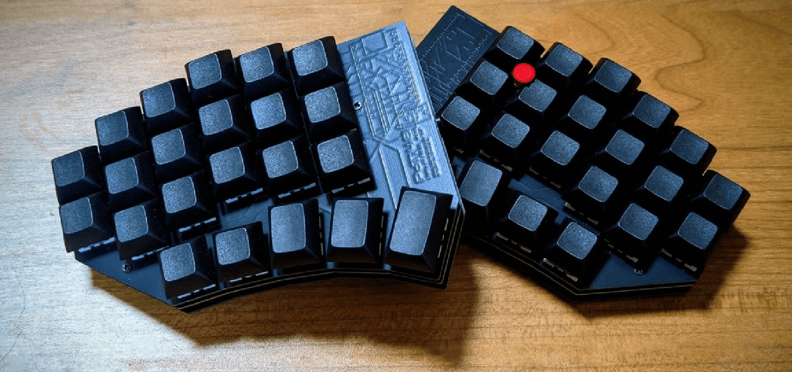

# Poti48

トラックポイント（PS/2）を搭載可能な 48キー 分割キーボードのファームウェアです。

MCU にRP2040を採用し、リマップツール[Vial](https://get.vial.today)に対応しています。

## 特徴

- **48キー 左右分割カラムスタッガード**
- **RP2040 搭載** — 十分なフラッシュ・メモリ容量
- **Vial 対応** — リアルタイムキーマップ編集、Dynamic Keymap、タップダンス、コンボ
- **トラックポイント (PS/2) 対応** — 分割構成で右側のみ接続、カスタムドライバ
- **マウスジェスチャ** — カーソル移動・静止・スクロール・プリサイス・ファストの5モード
- **MIDI 出力**
- **OS 自動検出** (Windows / macOS / Linux)

## ブランチ構成

| ブランチ | 内容 |
|----------|------|
| `main` | RP2040 版（現行） |
| `promicro` | ProMicro (ATmega32U4) 版（旧） |

## 機能詳細

- [マウスジェスチャ](docs/mouse-gesture.md) — ジェスチャモードとカスタムキーコードの解説
- [PS/2 トラックポイント分割対応](docs/ps2-split.md) — 左右分割構成での実装詳細
- [フラッシュレイアウトとストレージ設計](docs/flash-layout.md) — Dynamic Keymap・Raw HID ストレージ・EEPROM の配置
- [ビルドガイド（外部リンク）](https://memo.shibadogcap.com/p/poti48_guide/) — キーボードの組み立て手順

## ライセンス

[GNU General Public License v2.0 or later](LICENSE)
(QMK Firmware / Vial-QMK に準拠)
